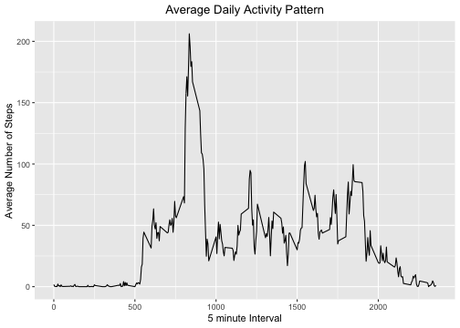
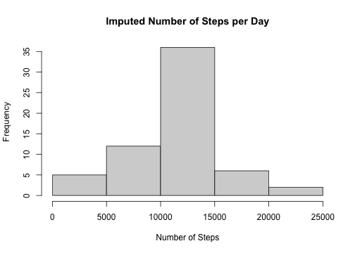
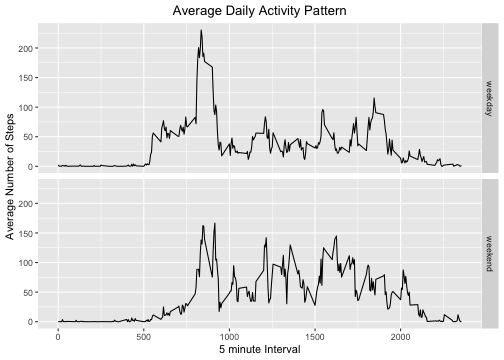

```r
library(knitr)
opts_chunk$set(echo = TRUE, results = TRUE, cache = TRUE)
```
## Loading and preprocessing the data

```r
setwd("/Users/youngjinlee/Desktop/Coursera-R")
data <- read.csv("activity.csv", header=TRUE)
```

## What is mean total number of steps taken per day?

```r
total <- aggregate(steps ~ date, data, FUN=sum)
hist(total$steps, main="Total Steps per Day", xlab="Number of Steps")
```


```r
meansteps <- mean(total$steps, na.rm=TRUE)
medsteps <- median(total$steps, na.rm=TRUE)
meansteps
```

```
## [1] 10766.19
```

```r
medsteps
```

```
## [1] 10765
```
## What is the average daily activity pattern?

```r
library(ggplot2)
meanbyint <- aggregate(steps ~ interval, data, mean)
ggplot(dat = meanbyint, aes(x=interval, y=steps)) + 
  geom_line() +
  ggtitle("Average Daily Activity Pattern") +
  xlab("5 minute Interval") +
  ylab("Average Number of Steps") +
  theme(plot.title=element_text(hjust=0.5))
```



```r
maxint <- meanbyint[which.max(meanbyint$steps),]
maxint
```

```
##     interval    steps
## 104      835 206.1698
```

## Imputing missing values

```r
missing <- is.na(data$steps)
imputing_data <- transform(data, steps=ifelse(is.na(data$steps), meanbyint$steps[match(data$interval, meanbyint$interval)],data$steps))
impbyint <- aggregate(steps ~ date, imputing_data, FUN=sum)
```

```r
hist(impbyint$steps,main="Imputed Number of Steps per Day", xlab="Number of Steps")
```



```r
impmeansteps <- mean(impbyint$steps, na.rm=TRUE)
impmedsteps <- median(impbyint$steps, na.rm=TRUE)
diffmean = impmeansteps - meansteps
diffmed = impmedsteps - medsteps
difftot = sum(impbyint$steps) - sum(total$steps)
impmeansteps
```

```
## [1] 10766.19
```

```r
impmedsteps
```

```
## [1] 10766.19
```

```r
diffmean
```

```
## [1] 0
```

```r
diffmed
```

```
## [1] 1.188679
```

```r
difftot
```

```
## [1] 86129.51
```

## Are there differences in activity patterns between weekdays and weekends?

```r
daytype <- function(date) {
  day <- weekdays(date)
  if (day %in% c('Monday','Tuesday', 'Wednesday', 'Thursday', 'Friday'))
    return("weekday")
  else if (day %in% c('Saturday','Sunday'))
    return("weekend")
  else
    stop("Invalid Date Format")
}
imputing_data$date <- as.Date(imputing_data$date)
imputing_data$day <- sapply(imputing_data$date, FUN = daytype)
meanbyday <- aggregate(steps ~ interval + day, imputing_data, mean)
ggplot(dat = meanbyday, aes(x = interval, y = steps)) +
  geom_line() +
  facet_grid(day ~ .) +
  ggtitle("Average Daily Activity Pattern") +
  xlab("5 minute Interval") +
  ylab("Average Number of Steps") +
  theme(plot.title = element_text(hjust=0.5))
```


kint2html()
